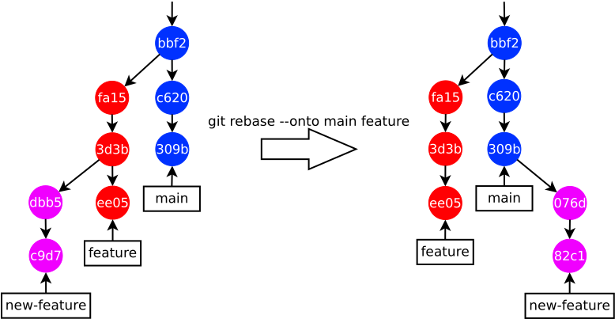

Заметки по Git
==============

Оригинал — [github.com/ololobster/git-notes](https://github.com/ololobster/git-notes).

1. [Введение](#введение)
1. [Работа с репозиториями](#работа-с-репозиториями):
   [настройки](#настройки),
   [удалённые репозитории](#удалённые-репозитории),
   [дочерние репозитории](#дочерние-репозитории)
1. [Работа с ветками](#работа-с-ветками):
   [merge vs rebase](#merge-vs-rebase)
1. [Работа с коммитами](#работа-с-коммитами):
   [reflog](#reflog)
1. [Работа с тегами](#работа-с-тегами)
1. [Анализ истории](#анализ-истории)
1. [Внутреннее устройство](#внутреннее-устройство):
   [объекты](#объекты),
   [прочее](#прочее)
1. [Подходы к выпуску релизов](#подходы-к-выпуску-релизов):
   [GitHub flow](#github-flow),
   [GitLab flow](#gitlab-flow),
   [Git flow](#git-flow)

# Введение

Git — это распределённая система контроля версий (VCS ака version control systems) от Линуса Торвальдса, созданная для работы над ядром Linux.
Распределённость означает, что все копии проекта (репозитории) равноправны и могут невозбранно подключаться друг к другу, чтобы скачать или отправить изменения.
На практике один из репов назначается главным, и через него члены команды обмениваются результатами своей работы.

История изменений представляет собой ориентированный граф из коммитов.
Каждый коммит — это снимок (snapshot) файлов и каталогов проекта.

Локальный реп — это каталог, в котором лежит дочерний каталог `.git` со служебными файлами Git.
Рабочее дерево (working tree) — это файлы и каталоги в локальном репе, всё кроме `.git`.
Зная ид коммита, можно выгрузить соответствующий снимок в рабочее дерево:
```
$ git checkout ⟨commit⟩
```

  
*Рабочее дерево этого репозитория.*

Staging area ака index — это новые файлы и модификации отслеживаемых файлов, которые помечены (при помощи `git add`) для внесения в следующий коммит.

  
*3 области локального репа и потоки данных между ними.
Staging area живёт в `.git`.*

Git предусматривает для файлов лишь 3 варианта прав: `100644` (обычный файл), `100755` (выполняемый файл), `120000` (символьная ссылка).

# Работа с репозиториями

Создать локальную копию другого репа:
```
$ git clone ⟨repo⟩ ⟨target directory⟩
```
Примечания:
1. Можно не указывать каталог, тогда будет использовано название исходного репа.
1. Если клонируем другой локальный реп (т.е. `⟨repo⟩` — это каталог), то используем `--no-hardlinks`.
1. При клонировании из исходного репа закачивается только главная ветка.
   Можно выбрать другую при помощи `-b ⟨branch⟩`.

Создать локальный репозиторий с нуля:
```
$ git init ⟨target directory⟩
```
Примечания:
1. Каталог под реп будет создан, если его не существует.
1. Можно не указывать каталог, тогда будет использован текущий.

### Настройки

Вывести/изменить значение параметра для текущего репа (хранится в `.git/config`):
```
$ git config ⟨param⟩
$ git config ⟨param⟩ ⟨value⟩
```
Вывести/изменить глобальное значение параметра (хранится в `~/.gitconfig`):
```
$ git config --global ⟨param⟩
$ git config --global ⟨param⟩ ⟨value⟩
```
Вывести все настройки:
```
$ git config --list --show-origin
```

Некоторые параметры:
1. `user.email` и `user.name` — информация по автору.
1. `core.autocrlf` (`true`, `false` или `input`) — надо ли править переводы строк в зависимости от ОС.
   Просто используем `false` в сочетании с UTF-8 и `\n`.
1. `init.defaultBranch` — название ветки по умолчанию.
   Обычно `master` или `main`.

### Удалённые репозитории

Удалённый реп (remote, upstream) — это другая копия проекта, к которой может подключаться локальный реп.
Может находиться на удалённом сервере (например, на GitHub или на GitLab), а может — в соседнем каталоге на той же ЭВМ.

Вывести список удалённых репов:
```
$ git remote -v
```

Добавить удалённый реп:
```
$ git remote add ⟨repo name⟩ ⟨repo URL⟩
```

Изменить URL удалённого репа:
```
$ git remote set-url ⟨repo name⟩ ⟨repo URL⟩
```

Выпилить удалённый реп:
```
$ git remote remove ⟨repo name⟩
```

### Дочерние репозитории

Клонировать репозиторий и сразу подтянуть его дочерние репозитории:
```
$ git clone --recurse-submodules ⟨repo⟩
```

Подтянуть дочерние репозитории:
```
$ git submodule update --init --recursive
```

Добавить дочерний репозиторий:
1. Перейти в нужную папку.
1. ```
   $ git submodule add ⟨repo⟩
   ```

# Работа с ветками

Ветка — это просто указатель на коммит, который является кончиком этой ветки.
У ветки под названием `⟨branch⟩` может быть 3 версии:
1. Ветка `⟨branch⟩` в удалённом репе.
1. Tracking-ветка под названием `⟨repo name⟩/⟨branch⟩`, находящаяся в локальном репе.
   Это копия ветки в удалённом репе.
1. Локальная ветка `⟨branch⟩`, куда мы коммитим.

Все 3 версии могут совпадать, а могут и отличаться (если в локальную и в удалённую ветку были добавлены новые коммиты).

Вывести список локальных веток:
```
$ git branch
```

Типовой сценарий — создать новую локальную ветку, переключиться на неё, сделать что-то хорошее, отправить эту ветку на удалённый реп `origin` для последующего оформления merge-реквеста:
```
$ git branch ⟨branch⟩
$ git checkout ⟨branch⟩
...
$ git push origin ⟨branch⟩
```

Создать новую локальную ветку от конкретного коммита:
```
$ git branch ⟨branch⟩ ⟨commit⟩
```

Удалить локальную ветку, которая уже залита в удалённый реп:
```
$ git branch -d ⟨branch⟩
```
Удалить локальную ветку, которая ещё не залита в удалённый реп:
```
$ git branch -D ⟨branch⟩
```

`git fetch` скачивает изменения, `git merge` сливает ветки, `git pull`  =  `git fetch`  +  `git merge`.

Скачать ветку из удалённого репа:
```
$ git fetch ⟨repo name⟩ ⟨branch⟩
```
Примечания:
1. В локальном репе появится (обновится) tracking-ветка под названием `⟨repo name⟩/⟨branch⟩`.
1. При этом локальная ветка `⟨branch⟩` не обновится.
1. Если локальной ветки `⟨branch⟩` ещё нет — то и не появится.
   Для этого ещё надо сделать `git checkout ⟨branch⟩`.

Скачать из удалённого репа ветку, которой ещё нет в локальном репе, создать соответствующую локальную ветку и переключиться на неё:
```
$ git checkout -b ⟨branch⟩ ⟨repo name⟩/⟨branch⟩
```

Допустим, мы накоммитили в локальную ветку `⟨branch⟩` какую-то ерунду.
Надо выпилить эти коммиты и привести ветку к состоянию как на удалённом репе.
На этой ветке выполняем:
```
$ git fetch ⟨repo name⟩ ⟨branch⟩
$ git reset --hard ⟨repo name⟩/⟨branch⟩
```

Если отправили неправильный коммит в удалённый реп:
1. Редактируем что надо (например, при помощи `git commit --amend`).
1. Отправляем в удаленный реп:
   ```
   $ git push --force ⟨repo name⟩ ⟨branch⟩
   ```

Примечание: НЕ надо так делать, если с этой веткой работают другие люди (см. золотое правило rebase).

Стащить коммит из другой ветки:
```
$ git cherry-pick ⟨commit⟩
```
Примечание: будет создана копия коммита, содержащая те же изменения.

### Merge vs rebase

  
*Походы к слиянию веток: merge-коммит vs rebase + fast-forward merge.
У merge-коммита 2 родителя вместо одного.
При fast-forward merge кончик ветки просто переставляется на другой коммит, новых коммитов не создаётся.*

Залить ветку `⟨branch⟩` в текущую ветку:
```
$ git merge ⟨branch⟩
```
Примечания:
1. `--ff` повелевает использовать fast-forward merge если это возможно.
   Это поведение по умолчанию.
1. `--no-ff` — создать merge-коммит, даже если возможен fast-forward merge.
1. `--ff-only` — либо fast-forward merge либо никак.

Взять из текущей ветки коммиты, которых нет в `⟨branch⟩`, и прикрепить их к кончику `⟨branch⟩` (см. картинку выше):
```
$ git rebase ⟨branch⟩
```
Примечания:
1. Теперь текущая ветка растёт прямо из кончика `⟨branch⟩`, можно делать fast-forward merge.
1. Можно предварительно посмотреть какие коммиты будут затронуты:
   ```
   $ git log ⟨branch⟩..HEAD
   ```
1. По умолчанию выбранные коммиты нанизываются на всё ту же ветку `⟨branch⟩`, но при помощи `--onto ⟨target branch⟩` можно выбрать другую целевую ветку (см. пример ниже).

Пример rebase с заданием целевой ветки: на `new-feature` всё готово (надо заливать в `main`), но на родительской ветке `feature` ещё идёт работа.
Находясь на `new-feature` выполнить:
```
$ git log --pretty=format:"%h" feature..HEAD
c9d7dde
dbb5c68
$ git rebase --onto main feature
```

  
*Пример rebase с заданием целевой ветки.*

Профит от rebase — это красивая история в одну линию.

`git rebase` создаёт абсолютно новые коммиты, копируя изменения, которые содержатся в старых коммитах.
Отсюда вытекает золотое правило rebase: НЕ делай rebase на общей ветке, которая существует в удалённом репе и используется другими людьми.
Если у разных людей в их локальных репах будут разные истории для одной и той же ветки, то это приведёт к геморрою при merge и бессмысленным кольцам в истории.

# Работа с коммитами

Вывести изменения в рабочем древе относительно `HEAD`:
```
$ git diff
```
Примечание: изменения, находящиеся в staging area, не будут отображены.

Вывести содержимое staging area:
```
$ git diff --staged
```
Примечание: `--staged` = `--cached`.

Создать коммит из того, что находится в staging area:
```
$ git commit
```
Примечания:
1. `-a` ака `--all` повелевает перенести все модификации отслеживаемых файлов в staging area, чтобы они тоже попали в коммит.
1. `--amend` повелевает перезаписать предыдущий коммит (его изменения сохранятся, к ним добавятся новые).

Удалить отслеживаемый файл:
```
$ git rm ⟨file⟩
```
Примечания:
1. Файл будет удалён из рабочего древа + его удаление будет занесено в staging area.
1. Можно просто удалить файл из рабочего древа, а потом вызвать `git commit` с `-a`.
1. При помощи шаблона можно выпилить сразу много файлов.
   Пример: `log/\*.log`.

Если по ошибке занесли неотслеживаемый файл в staging area, но ещё не закоммитили:
```
$ git rm --cached ⟨file⟩
```

Сбросить все изменения (и в staging area и в рабочем древе):
```
$ git checkout HEAD -f
```
Сбросить все изменения файла (и в staging area и в рабочем древе):
```
$ git checkout HEAD -- ⟨file⟩
```
Примечание: также поможет если по ошибке вызвали `git rm` для отслеживаемого файла, но ещё не закоммитили.

Удалить из рабочего древа неотслеживаемые файлы и каталоги:
```
$ git clean -f -d
```
Примечание: `-n` повелевает сделать холостой проход и вывести что будет удалено.

### Reflog

Reflog (reference log) — это записи о перемещениях кончиков веток и `HEAD`.
Например, `HEAD@{2}` означает «куда `HEAD` указывал 2 перемещения назад».
Простое переключение с ветки на ветку при помощи `git checkout` также добавляет новые записи для `HEAD`.

Вывести последние N записей reflog для `HEAD`:
```
$ git reflog show -n ⟨N⟩
```
Вывести записи reflog для заданной ветки:
```
$ git reflog show ⟨branch⟩
```

Git ничего не забывает ~~и не прощает~~, например, `git commit --amend` не перезаписывает последний коммит, а создаёт новый ему на замену (старый остаётся в недрах Git).
Это позволяет много чего отменить.

Отменить последний коммит, если нужно сохранить изменения:
```
$ git reset --soft HEAD@{1}
```
Примечание: эти изменения будут лежать в staging area.

Отменить последний коммит, если изменения не нужны:
```
$ git reset --hard HEAD@{1}
```

Отменить ошибочное применение `git commit --amend`:
```
$ git reset --soft HEAD@{1}
$ git commit -C HEAD@{1}
```

# Работа с тегами

Вывести все теги:
```
$ git tag
```

Искать теги по шаблону:
```
$ git tag -l "poppler-20.*"
```

Вывести последний тег:
```
$ git describe --abbrev=0 --tags
```

Создать простой (lightweight) тег на последнем коммите:
```
$ git tag ⟨tag⟩
```

Создать простой тег на заданном коммите:
```
$ git tag ⟨tag⟩ ⟨commit⟩
```

По умолчанию `git push` не заливает теги в удалённый репозиторий.
Для этого надо вызвать:
```
$ git push ⟨repo name⟩ ⟨tag⟩
```

# Анализ истории

Вывести последние N коммитов:
```
$ git log -n ⟨N⟩
```

Найти коммиты, где был добавлен/удалён фрагмент кода:
```
$ git log -S ⟨piece of code⟩
```
Найти коммиты, где в конкретном файле был добавлен/удалён фрагмент кода:
```
$ git log -S ⟨piece of code⟩ -- ⟨file⟩
```
Примечания:
1. Если была просто изменена строка, куда входит `⟨piece of code⟩`, то такой коммит не считается.
1. Можно скормить целый блок кода в несколько строк, чтобы найти коммит, в котором этот блок был добавлен.

Вывести изменения коммита:
```
$ git diff ⟨commit⟩^!
```

Посмотреть разницу между 2 ветками:
```
$ git diff ⟨branch 1⟩..⟨branch 2⟩
```
Посмотреть разницу между 2 ветками для конкретного файла:
```
$ git diff ⟨branch 1⟩..⟨branch 2⟩ -- ⟨file⟩
```
Примечания:
1. Можно указать tracking-ветку, например, `origin/debian`.
1. Если `git diff` заменить на `git log`, то выдаст ту же разницу в виде списка коммитов.

# Внутреннее устройство

### Объекты

Единицей хранения данных является объект, который идентифицируется 40-символьным хешем SHA1.
Т.е. Git является key-value хранилищем.
Объекты хранятся в `.git/objects`.

Типы объектов:
1. BLOB — это содержимое файла (ни имени файла, ни прав доступа тут нет).
   Если добавить в репозиторий 2 копии одного файла, то BLOB-объект будет один, т.к. хеш SHA1 одинаковый.
1. Tree — это каталог, т.е. список дочерних файлов и каталогов, их прав и соответствующих им BLOB-объектов.
1. Коммит, имеющий следующие свойства:
   - `tree` — корневой каталог репозитория (коммит не хранит дельту);
   - `parent` — предшествующий коммит (2 шт. если это merge-коммит);
   - `author`, `committer` — информация по автору;
   - `message`.

   История изменений в Git — это граф из объектов-коммитов.

Узнать тип объекта:
```
$ git cat-file -t ⟨id⟩
```

Пример создания коммита без высокоуровневых команд `git add` и `git commit`:
1. Создаём BLOB-объект:
   ```
   $ echo 'my blob' | git hash-object -w --stdin
   0b729d77bcd6e98e02910a24d781736df537ef13
   $ git cat-file -t 0b729d77
   blob
   $ git cat-file -p 0b729d77
   my blob
   ```
   В `.git/objects` появился новый файл:
   ```
   $ ls .git/objects/0b
   729d77bcd6e98e02910a24d781736df537ef13
   ```
1. Добавляем в корневой каталог новый файл `my_blob.txt` с правами `100644`:
   ```
   $ git update-index --add --cacheinfo 100644 0b729d77bcd6e98e02910a24d781736df537ef13 my_blob.txt
   $ git write-tree
   6fd058384276fe29baced4899f2a06f671989d6e
   $ git cat-file -t 6fd05838
   tree
   $ git cat-file -p 6fd05838
   ...
   100644 blob 0b729d77bcd6e98e02910a24d781736df537ef13 my_blob.txt
   ```
1. Создаём коммит на основе нового дерева `6fd05838` (предшествующий коммит — `3b64db71`):
   ```
   $ git commit-tree 6fd05838 -p 3b64db71 -m 'test'
   73008467263c517658273f774b992ac135d019a6
   $ git cat-file -t 73008467
   commit
   ```
1. Переставляем кончик ветки `main` на новый коммит:
   ```
   $ git update-ref refs/heads/main 73008467
   ```
1. `git log` показывает всё корректно, но файла `my_blob.txt` нету в working tree...
   ```
   $ git checkout HEAD -- my_blob.txt
   ```

### Прочее

Ветка — это просто ид коммита, который является кончиком данной ветки, тег — аналогично.
Всё это добро лежит в каталоге каталоге `.git/refs` и в файле `.git/packed-refs`.
Можно посмотреть этот ид коммита:
```
$ git rev-parse ⟨branch or tag⟩
```
Примечание: для tracking-ветки указываем `⟨repo name⟩/⟨branch⟩`.

Текстовый файл `.git/HEAD` указывает на текущий коммит.
Если мы на ветке `main`, то `.git/HEAD` выглядит так:
```
ref: refs/heads/main
```
Если мы переключились на конкретный коммит `c61f0c0a`, то `.git/HEAD` выглядит так:
```
c61f0c0afdf2ae48db1f0b15cf1cc0023d88c203
```

Reflog хранится в `.git/logs`:
- история `HEAD` — в файле `.git/logs/HEAD`,
- история ветки — в файле `.git/logs/refs/heads/⟨branch⟩`.

# Подходы к выпуску релизов

### GitHub flow

Работа над фичами идёт в отдельных ветках.
Ветка `main` всегда должна оставаться стабильной.
Если что-то залито в `main`, то можно и должно деплоить новую версию (по заветам continuous delivery).

Очень простая схема.
Подойдёт для SaaS-приложения, которое деплоится каждый день или чаще.

См. также:
1. [Understanding the GitHub flow](https://guides.github.com/introduction/flow/).
1. [GitHub Flow](http://scottchacon.com/2011/08/31/github-flow.html) — Scott Chacon.

### GitLab flow

1-я схема: усовершенствованный GitHub flow с ветками `main` (или `development`) и `production`.
Новым релизом считается заливание `main` в `production`.

Сложность: просто.
Удобнее GitHub flow, когда мы не можем мгновенно задеплоить новую версию в любой момент (например, есть deployment windows, есть модерация мобильных приложений в Apple App Store и т.д.), а разработка в `main` не должна останавливаться.

2-я схема: каждая ветка соответствует какому-либо окружению.
При обновлении ветки происходит деплой в соответствующее окружение.
Пример: тестовые окружения для веток `main` и `pre-production`, а ветка `production` деплоится на боевые сервера.

  
*GitLab flow с ветками, соответствующими окружениям.*

3-я схема: `main` предназначена для разработки нового релиза.
Когда релиз пора выпускать, из `main` отпочковывается специальная ветка, где его будут тестировать, шлифовать  и поддерживать.
Выпуском новой версии считается изменение в релизной ветке (опционально — добавление тега в релизную ветку).

Схема предназначена для ситуаций, когда
- надо долго поддерживать старые версии в работоспособном состоянии, выпуская обновления;
- есть разные вариации продукта, например, для Windows и для Linux, для iOS и для Android.

  
*GitLab flow с ветками, соответствующими релизам.*

См. также:
1. [Introduction to GitLab Flow](https://docs.gitlab.com/ee/topics/gitlab_flow.html).

### Git flow

Используемые ветки:
1. `develop` предназначена для разработки нового релиза.
1. `main` всегда должна оставаться супер-стабильной.
   Любая заливка в `main` означает выпуск новой версии, соответствующий коммит помечается тегом.
1. Работа над новыми фичами идёт в отдельных ветках, они вливаются в `develop`.
1. Когда релиз почти готов, из `develop` отпочковывается специальная ветка, где его будут тестировать и шлифовать (в `develop` продолжается работа над следующим релизом).
   Когда релиз готов, эта ветка вливается в `main`.
1. Ветки для оперативного исправления серьёзных багов, которые вливаются и в `main` и в `develop`.

  
*Git flow.*

Очень сложно.
Может подойти, если есть хорошая документация и команда придерживается месячного или квартального цикла выпуска релизов.

См. также:
1. [A successful Git branching model](https://nvie.com/posts/a-successful-git-branching-model/) — Vincent Driessen.
